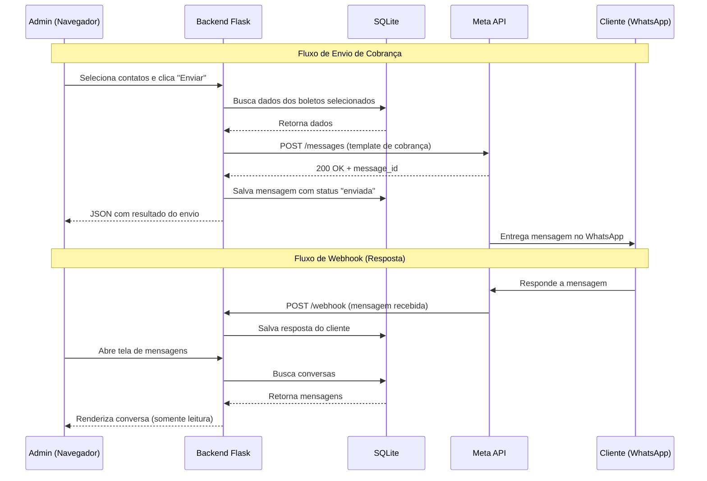
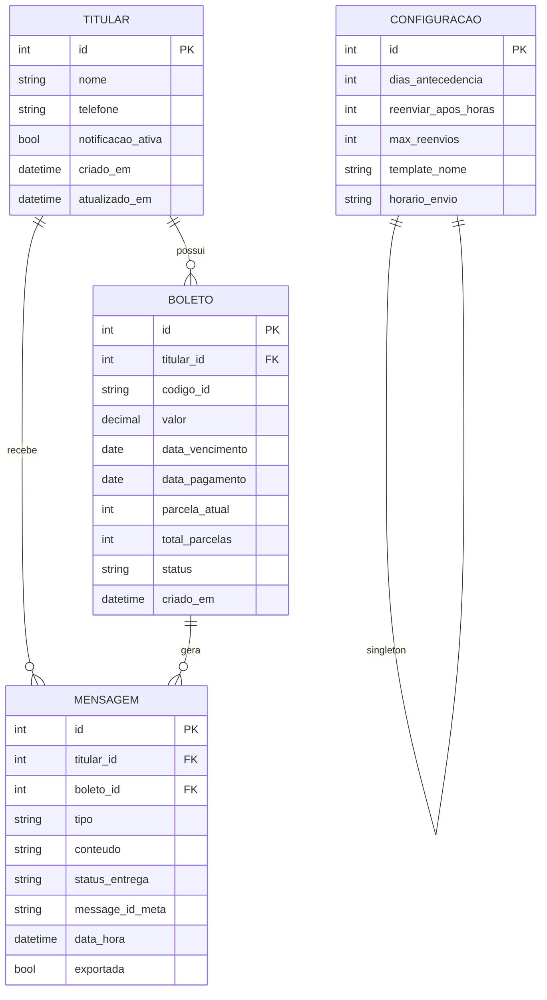

# 📋 Documentação do Projeto — CRM BoletosZap

> **Versão:** 1.0  
> **Data:** 08/07/2026  

---

## 1. Visão Geral do Projeto

O **CRM BoletosZap** é um sistema de gestão de cobranças que automatiza o envio de notificações de pagamento de boletos via WhatsApp, utilizando a API oficial da Meta (WhatsApp Business Cloud API).

A aplicação roda **localmente** como um executável que abre um servidor web (`localhost`) no navegador do administrador, conectando-se a um banco de dados local para gerenciar titulares, boletos, mensagens e logs de conversa.

### 1.1 Objetivo Principal

Permitir que um gestor financeiro:
- Cadastre titulares e seus boletos
- Configure regras automáticas de cobrança
- Envie notificações de pagamento via WhatsApp
- Acompanhe o status de entrega e leitura das mensagens
- Visualize respostas dos clientes (somente leitura)
- Gerencie dados conforme a LGPD (apagar ou arquivar conversas)

### 1.2 Público-Alvo

Administradores financeiros, escritórios de cobrança, pequenas e médias empresas que precisam automatizar cobranças recorrentes de boletos.

---

## 2. Arquitetura do Sistema

```
┌─────────────────────────────────────────────────┐
│           Frontend (HTML + CSS + JS)            │
│   Servido pelo Flask via templates Jinja2       │
│   Roda no navegador em localhost:5000           │
└──────────────────┬──────────────────────────────┘
                   │ HTTP / API REST (fetch)
                   │
┌──────────────────▼──────────────────────────────┐
│          Backend Python (Flask)                 │
│   - Serve as páginas HTML                       │
│   - Expõe API REST para o frontend              │
│   - Processa webhooks da Meta                   │
│   - Executa lógica de envio automático          │
│   - Gerencia logs e conformidade LGPD           │
└──────────────────┬──────────────────────────────┘
                   │ SQLAlchemy ORM
                   │
┌──────────────────▼──────────────────────────────┐
│         Banco de Dados (SQLite)                 │
│   Tabelas: titulares, boletos, mensagens,       │
│            configuracoes, logs                  │
└─────────────────────────────────────────────────┘
                   │
                   │ HTTPS (requests)
                   │
┌──────────────────▼──────────────────────────────┐
│      Meta WhatsApp Business Cloud API           │
│   - Envio de mensagens (templates aprovados)    │
│   - Webhook: status de entrega (sent/delivered/ │
│     read/failed)                                │
│   - Webhook: respostas dos clientes             │
└─────────────────────────────────────────────────┘
```

### 2.1 Fluxo de Dados



---

## 3. Stack Tecnológica

### 3.1 Tecnologias Principais

| Camada | Tecnologia | Versão Recomendada | Justificativa |
|---|---|---|---|
| **Backend** | Python + Flask | Python 3.11+ / Flask 3.x | Micro-framework leve, ideal para APIs REST e servir HTML. Grande comunidade e documentação em português. |
| **Frontend** | HTML5 + CSS3 + Vanilla JavaScript | — | Sem dependência de frameworks JS. Simplicidade, controle total, sem build step. |
| **Templates** | Jinja2 | (incluso no Flask) | Motor de templates nativo do Flask para renderizar HTML dinâmico. |
| **Banco de Dados** | SQLite | (incluso no Python) | Zero configuração, banco em arquivo local. Perfeito para uso single-user. |
| **ORM** | SQLAlchemy | 2.x | Abstrai o banco de dados, permite migrar para MySQL/PostgreSQL no futuro alterando apenas a string de conexão. |
| **Migrations** | Alembic | 1.x | Versionamento de schema do banco, integrado com SQLAlchemy. |
| **WhatsApp API** | Meta WhatsApp Business Cloud API | v18.0+ | API oficial da Meta para envio e recebimento de mensagens. |
| **HTTP Client** | Requests | 2.x | Biblioteca Python para chamadas HTTP à API da Meta. |
| **Agendamento** | APScheduler | 3.x | Tarefas agendadas (verificar boletos próximos do vencimento e enviar cobranças automaticamente). |
| **Empacotamento** | PyInstaller ou script .bat | — | Gera executável ou script que inicia o servidor e abre o navegador. |

### 3.2 Dependências Python (requirements.txt)

```
flask>=3.0
sqlalchemy>=2.0
alembic>=1.13
requests>=2.31
apscheduler>=3.10
python-dotenv>=1.0
gunicorn>=21.2  # para deploy em produção (futuro)
```

### 3.3 Pré-requisitos da Meta API

> [!IMPORTANT]
> Para utilizar a WhatsApp Business Cloud API, é necessário:

| Requisito | Descrição |
|---|---|
| **Conta Meta Business** | Conta verificada no [Meta Business Suite](https://business.facebook.com) |
| **App no Meta Developers** | Aplicação criada em [developers.facebook.com](https://developers.facebook.com) com o produto "WhatsApp" adicionado |
| **Número de telefone** | Número dedicado registrado na plataforma (não pode ser o mesmo do WhatsApp pessoal) |
| **Token de acesso** | Token permanente gerado no painel do app para autenticação nas chamadas da API |
| **Templates aprovados** | Mensagens pré-aprovadas pela Meta na categoria "utility" (utilitárias) para envio proativo de cobranças |
| **Webhook configurado** | URL pública (ou túnel via ngrok em dev) para receber notificações da Meta |

---

## 4. Funcionalidades Detalhadas

### 4.1 Envio Automático de Cobranças via WhatsApp

**Descrição:**  
O sistema envia automaticamente mensagens de cobrança para os titulares de boletos via WhatsApp, utilizando templates pré-aprovados pela Meta. O envio é disparado com base em regras configuráveis definidas pelo administrador (ex: "enviar 3 dias antes do vencimento").

**Comportamento:**
1. O **APScheduler** roda em background verificando periodicamente (ex: a cada hora) os boletos no banco de dados
2. Filtra boletos cujo vencimento se enquadra nas regras configuradas E cujo titular está marcado para receber notificações
3. Para cada boleto elegível, faz uma chamada `POST` à Meta API com o template de cobrança preenchido com as variáveis do titular
4. Salva no banco o registro da mensagem com status inicial `enviada` e o `message_id` retornado pela Meta
5. Webhooks da Meta atualizam o status para `entregue`, `lida` ou `falhou`

**Template de Mensagem (exemplo submetido à Meta):**

```
Olá {{1}}, informamos que seu boleto no valor de R${{2}} 
vence em {{3}}. 
Parcela: {{4}}/{{5}}
Código do boleto: {{6}}

Em caso de dúvidas, entre em contato com nosso escritório.
```

| Variável | Campo do Banco |
|---|---|
| `{{1}}` | `titular.nome` |
| `{{2}}` | `boleto.valor` |
| `{{3}}` | `boleto.data_vencimento` |
| `{{4}}` | `boleto.parcela_atual` |
| `{{5}}` | `boleto.total_parcelas` |
| `{{6}}` | `boleto.codigo_id` |

**Retorno esperado da API da Meta (sucesso):**
```json
{
  "messaging_product": "whatsapp",
  "contacts": [
    { "input": "5511999998888", "wa_id": "5511999998888" }
  ],
  "messages": [
    { "id": "wamid.HBgNNTUxMTk5OTk5ODg4OBUCABIYFjNFQjBCNUM2..." }
  ]
}
```

**Retorno esperado da API da Meta (falha):**
```json
{
  "error": {
    "message": "Invalid parameter",
    "type": "OAuthException",
    "code": 100,
    "error_subcode": 2494010,
    "fbtrace_id": "A1B2C3D4E5"
  }
}
```

---

### 4.2 Lista de Contatos e Gestão de Boletos

**Descrição:**  
Tela principal do sistema onde o administrador visualiza todos os titulares cadastrados, seus boletos, datas de vencimento, valores, status de pagamento e controla quais titulares devem receber notificações de cobrança.

**Funcionalidades da tela:**
- **Listagem em tabela** com colunas: checkbox de seleção, nome do titular, data de vencimento, valor, parcela atual, status do pagamento
- **Busca/filtro** por nome do titular
- **Checkbox individual** para marcar/desmarcar quem recebe notificação
- **Botão de envio manual** para disparar cobrança aos selecionados
- **Cadastro de novo titular** com formulário (nome, telefone, dados do boleto)
- **Edição e exclusão** de titulares existentes
- **Indicadores visuais de status:**
  - 🟢 **Pago** — boleto já foi pago
  - 🟡 **Pendente** — dentro do prazo, ainda não pago
  - 🔴 **Atrasado** — vencimento ultrapassado

**Wireframe da tela:**

```
┌─────────────────────────────────────────────────────────────────┐
│  BoletosZap CRM          [Dashboard] [Contatos] [Msgs] [Config]│
├─────────────────────────────────────────────────────────────────┤
│                                                                 │
│  Contatos & Boletos                          [+ Novo Titular]   │
│                                                                 │
│  🔍 Buscar por nome...           Filtrar: [Todos ▼]            │
│                                                                 │
│  ┌────┬────────────────┬────────────┬─────────┬───────┬───────┐ │
│  │ ☐  │ Nome           │ Vencimento │ Valor   │ Parc. │Status │ │
│  ├────┼────────────────┼────────────┼─────────┼───────┼───────┤ │
│  │ ☑  │ João Silva     │ 10/07/2026 │ R$450   │ 3/12  │🟡 Pend│ │
│  │ ☑  │ Maria Santos   │ 12/07/2026 │ R$320   │ 7/10  │🟢 Pago│ │
│  │ ☐  │ Pedro Souza    │ 15/07/2026 │ R$180   │ 1/6   │🔴 Atr.│ │
│  │ ☑  │ Ana Oliveira   │ 20/07/2026 │ R$550   │ 5/12  │🟡 Pend│ │
│  └────┴────────────────┴────────────┴─────────┴───────┴───────┘ │
│                                                                 │
│  3 selecionados         [📩 Enviar Cobrança para Selecionados] │
│                                                                 │
└─────────────────────────────────────────────────────────────────┘
```

**Endpoint da API — Listar contatos:**

`GET /api/contatos`

Retorno esperado:
```json
{
  "contatos": [
    {
      "id": 1,
      "nome": "João Silva",
      "telefone": "5511999998888",
      "notificacao_ativa": true,
      "boleto": {
        "codigo_id": "BOL-2026-001",
        "valor": 450.00,
        "data_vencimento": "2026-07-10",
        "data_pagamento": null,
        "parcela_atual": 3,
        "total_parcelas": 12,
        "status": "pendente"
      }
    },
    {
      "id": 2,
      "nome": "Maria Santos",
      "telefone": "5511988887777",
      "notificacao_ativa": true,
      "boleto": {
        "codigo_id": "BOL-2026-002",
        "valor": 320.00,
        "data_vencimento": "2026-07-12",
        "data_pagamento": "2026-07-08",
        "parcela_atual": 7,
        "total_parcelas": 10,
        "status": "pago"
      }
    }
  ],
  "total": 2
}
```

**Endpoint da API — Cadastrar novo titular:**

`POST /api/contatos`

Body:
```json
{
  "nome": "Carlos Ferreira",
  "telefone": "5511977776666",
  "boleto": {
    "codigo_id": "BOL-2026-003",
    "valor": 280.00,
    "data_vencimento": "2026-08-01",
    "parcela_atual": 1,
    "total_parcelas": 6
  }
}
```

Retorno (sucesso):
```json
{
  "message": "Titular cadastrado com sucesso",
  "contato": {
    "id": 3,
    "nome": "Carlos Ferreira",
    "telefone": "5511977776666",
    "notificacao_ativa": true
  }
}
```

---

### 4.3 Visualização de Mensagens e Respostas (Somente Leitura)

**Descrição:**  
Tela onde o administrador visualiza o histórico de todas as mensagens de cobrança enviadas e as respostas recebidas dos clientes. O admin **não pode responder** — a tela é estritamente de leitura. Os dados chegam via webhook da Meta.

**Comportamento:**
1. A lista da esquerda mostra todos os contatos que tiveram interação (mensagens enviadas ou respostas recebidas)
2. Ao clicar em um contato, o painel da direita exibe o histórico da conversa em ordem cronológica
3. Cada mensagem mostra: remetente (BOT ou CLIENTE), data/hora, conteúdo e status de entrega
4. **Não existe campo de input/resposta** — garantindo que a comunicação seja unidirecional

**Wireframe da tela:**

```
┌──────────────────────────────────────────────────────────────────┐
│  BoletosZap CRM          [Dashboard] [Contatos] [Msgs] [Config] │
├──────────────────────────┬───────────────────────────────────────┤
│  Conversas               │  João Silva                          │
│  ──────────────────────  │  📱 (11) 99999-8888                  │
│  🔍 Buscar...            │  ─────────────────────────────────── │
│                          │                                       │
│  ┌──────────────────┐    │  ┌─────────────────────────────────┐ │
│  │ João Silva       │◄───│  │ [BOT] 08/07/2026 14:00          │ │
│  │ 2 mensagens      │    │  │ Olá João, informamos que seu    │ │
│  │ Última: hoje     │    │  │ boleto no valor de R$450,00     │ │
│  ├──────────────────┤    │  │ vence em 10/07/2026.            │ │
│  │ Maria Santos     │    │  │ Parcela: 3/12                   │ │
│  │ 1 mensagem       │    │  │ Código: BOL-2026-001            │ │
│  │ Última: ontem    │    │  │                                 │ │
│  ├──────────────────┤    │  │ Status: ✅ Entregue · ✅ Lida   │ │
│  │ Pedro Souza      │    │  └─────────────────────────────────┘ │
│  │ 0 mensagens      │    │                                       │
│  └──────────────────┘    │  ┌─────────────────────────────────┐ │
│                          │  │ [CLIENTE] 08/07/2026 14:05       │ │
│                          │  │ Ok, vou pagar amanhã             │ │
│                          │  └─────────────────────────────────┘ │
│                          │                                       │
│                          │  ─────────────────────────────────── │
│                          │  [🗑️ Apagar Conversa] [💾 Salvar Log]│
└──────────────────────────┴───────────────────────────────────────┘
```

**Endpoint da API — Listar conversas:**

`GET /api/mensagens`

Retorno:
```json
{
  "conversas": [
    {
      "contato_id": 1,
      "nome": "João Silva",
      "telefone": "5511999998888",
      "total_mensagens": 2,
      "ultima_mensagem": "2026-07-08T14:05:00",
      "nao_lidas": 1
    },
    {
      "contato_id": 2,
      "nome": "Maria Santos",
      "telefone": "5511988887777",
      "total_mensagens": 1,
      "ultima_mensagem": "2026-07-07T10:30:00",
      "nao_lidas": 0
    }
  ]
}
```

**Endpoint da API — Histórico de um contato:**

`GET /api/mensagens/{contato_id}`

Retorno:
```json
{
  "contato": {
    "id": 1,
    "nome": "João Silva",
    "telefone": "5511999998888"
  },
  "mensagens": [
    {
      "id": 101,
      "tipo": "enviada",
      "conteudo": "Olá João, informamos que seu boleto no valor de R$450,00 vence em 10/07/2026. Parcela: 3/12. Código: BOL-2026-001",
      "data_hora": "2026-07-08T14:00:00",
      "status": "read",
      "message_id_meta": "wamid.HBgNNTUxMTk5OTk5ODg4OBUCABIYFjNFQjBCNUM2..."
    },
    {
      "id": 102,
      "tipo": "recebida",
      "conteudo": "Ok, vou pagar amanhã",
      "data_hora": "2026-07-08T14:05:00",
      "status": null,
      "message_id_meta": "wamid.HBgNNTUxMTk5OTk5ODg4OBUCABEYFjNFQjBCNUM3..."
    }
  ]
}
```

**Webhook da Meta — Recebimento de mensagem do cliente:**

A Meta envia um `POST` para `/webhook/meta` com o payload:
```json
{
  "object": "whatsapp_business_account",
  "entry": [
    {
      "id": "WHATSAPP_BUSINESS_ACCOUNT_ID",
      "changes": [
        {
          "value": {
            "messaging_product": "whatsapp",
            "metadata": {
              "display_phone_number": "5511900001111",
              "phone_number_id": "PHONE_NUMBER_ID"
            },
            "messages": [
              {
                "from": "5511999998888",
                "id": "wamid.HBgNNTUxMTk5OTk5ODg4OBUCABEYFjNFQjBCNUM3...",
                "timestamp": "1720450800",
                "text": { "body": "Ok, vou pagar amanhã" },
                "type": "text"
              }
            ]
          },
          "field": "messages"
        }
      ]
    }
  ]
}
```

**Webhook da Meta — Atualização de status de entrega:**

```json
{
  "object": "whatsapp_business_account",
  "entry": [
    {
      "changes": [
        {
          "value": {
            "statuses": [
              {
                "id": "wamid.HBgNNTUxMTk5OTk5ODg4OBUCABIYFjNFQjBCNUM2...",
                "status": "delivered",
                "timestamp": "1720447230",
                "recipient_id": "5511999998888"
              }
            ]
          },
          "field": "messages"
        }
      ]
    }
  ]
}
```

Possíveis valores de `status`: `sent`, `delivered`, `read`, `failed`.

---

### 4.4 Gerenciamento de Conversas — LGPD

**Descrição:**  
Funcionalidade que permite ao administrador apagar conversas inteiras com um cliente (atendendo à Lei Geral de Proteção de Dados) ou salvá-las como arquivos de log para fins de auditoria e debugging.

**Opções por conversa:**

| Ação | Comportamento |
|---|---|
| **🗑️ Apagar Conversa** | Remove todas as mensagens (enviadas e recebidas) do banco de dados referentes àquele contato. A ação é irreversível. Antes de confirmar, exibe um modal: *"Tem certeza? Esta ação apagará X mensagens permanentemente."* |
| **💾 Salvar em Log** | Exporta a conversa completa em um arquivo `.txt` ou `.json` para uma pasta local configurável (ex: `./logs/conversas/`), com data, hora, remetente e conteúdo de cada mensagem. |

**Endpoint da API — Apagar conversa:**

`DELETE /api/mensagens/{contato_id}`

Retorno:
```json
{
  "message": "Conversa com João Silva apagada com sucesso",
  "mensagens_removidas": 2
}
```

**Endpoint da API — Exportar conversa para log:**

`POST /api/mensagens/{contato_id}/exportar`

Retorno:
```json
{
  "message": "Conversa exportada com sucesso",
  "arquivo": "./logs/conversas/joao_silva_2026-07-08.json",
  "mensagens_exportadas": 2
}
```

**Formato do arquivo de log exportado:**
```json
{
  "exportado_em": "2026-07-08T15:30:00",
  "contato": {
    "nome": "João Silva",
    "telefone": "5511999998888"
  },
  "mensagens": [
    {
      "tipo": "enviada",
      "conteudo": "Olá João, informamos que seu boleto...",
      "data_hora": "2026-07-08T14:00:00",
      "status": "read"
    },
    {
      "tipo": "recebida",
      "conteudo": "Ok, vou pagar amanhã",
      "data_hora": "2026-07-08T14:05:00"
    }
  ]
}
```

---

### 4.5 Dashboard — Painel de Visão Geral

**Descrição:**  
Tela inicial do sistema que apresenta um resumo consolidado do estado atual das cobranças, boletos e mensagens.

**Elementos do dashboard:**

| Card | Dado exibido | Fonte |
|---|---|---|
| **Boletos Ativos** | Total de boletos com status "pendente" ou "atrasado" | `COUNT` de boletos não pagos |
| **Vencem Esta Semana** | Boletos com vencimento nos próximos 7 dias | Filtro por `data_vencimento` |
| **Mensagens Enviadas (hoje)** | Total de cobranças disparadas no dia | `COUNT` de mensagens do dia |
| **Taxa de Leitura** | % de mensagens com status "read" | `read / total * 100` |

**Tabela de últimas cobranças:**

| Titular | Valor | Status Envio | Leitura |
|---|---|---|---|
| João Silva | R$450 | ✅ Enviada | ✅ Lida |
| Maria Santos | R$320 | ✅ Enviada | — |
| Pedro Souza | R$180 | ❌ Falhou | — |

**Wireframe da tela:**

```
┌──────────────────────────────────────────────────────────────────┐
│  BoletosZap CRM          [Dashboard] [Contatos] [Msgs] [Config] │
├──────────────────────────────────────────────────────────────────┤
│                                                                  │
│  ┌──────────────┐  ┌──────────────┐  ┌──────────────┐  ┌──────┐ │
│  │  📊 12       │  │  ⚠️  5       │  │  📩 8        │  │ 75%  │ │
│  │  Boletos     │  │  Vencem      │  │  Enviadas    │  │ Taxa │ │
│  │  Ativos      │  │  Esta Semana │  │  Hoje        │  │ Leit.│ │
│  └──────────────┘  └──────────────┘  └──────────────┘  └──────┘ │
│                                                                  │
│  Últimas Cobranças Enviadas                                      │
│  ┌───────────────┬─────────┬──────────────┬──────────┐           │
│  │ Titular       │ Valor   │ Status Envio │ Leitura  │           │
│  ├───────────────┼─────────┼──────────────┼──────────┤           │
│  │ João Silva    │ R$450   │ ✅ Enviada   │ ✅ Lida  │           │
│  │ Maria Santos  │ R$320   │ ✅ Enviada   │ —        │           │
│  │ Pedro Souza   │ R$180   │ ❌ Falhou    │ —        │           │
│  └───────────────┴─────────┴──────────────┴──────────┘           │
│                                                                  │
└──────────────────────────────────────────────────────────────────┘
```

**Endpoint da API — Dados do dashboard:**

`GET /api/dashboard`

Retorno:
```json
{
  "resumo": {
    "boletos_ativos": 12,
    "vencem_esta_semana": 5,
    "mensagens_enviadas_hoje": 8,
    "taxa_leitura": 75.0
  },
  "ultimas_cobrancas": [
    {
      "titular": "João Silva",
      "valor": 450.00,
      "status_envio": "sent",
      "status_leitura": "read",
      "data_envio": "2026-07-08T14:00:00"
    },
    {
      "titular": "Maria Santos",
      "valor": 320.00,
      "status_envio": "sent",
      "status_leitura": "delivered",
      "data_envio": "2026-07-08T14:00:00"
    },
    {
      "titular": "Pedro Souza",
      "valor": 180.00,
      "status_envio": "failed",
      "status_leitura": null,
      "data_envio": "2026-07-08T14:00:00"
    }
  ]
}
```

---

### 4.6 Configurações — Regras de Cobrança Automática

**Descrição:**  
Tela onde o administrador define as condições automáticas para o envio de cobranças, como antecedência em dias, reenvios e seleção do template.

**Parâmetros configuráveis:**

| Parâmetro | Tipo | Descrição | Exemplo |
|---|---|---|---|
| `dias_antecedencia` | `int` | Quantos dias antes do vencimento a cobrança deve ser enviada | `3` |
| `reenviar_apos_horas` | `int` | Se a mensagem não for lida, reenviar após X horas | `24` |
| `max_reenvios` | `int` | Limite de reenvios por boleto | `2` |
| `template_nome` | `string` | Nome do template aprovado pela Meta a ser utilizado | `"cobranca_boleto_v1"` |
| `horario_envio` | `string` | Horário preferencial de envio (HH:MM) | `"09:00"` |

**Wireframe da tela:**

```
┌──────────────────────────────────────────────────────────────────┐
│  BoletosZap CRM          [Dashboard] [Contatos] [Msgs] [Config] │
├──────────────────────────────────────────────────────────────────┤
│                                                                  │
│  ⚙️ Configurações de Cobrança Automática                        │
│                                                                  │
│  Enviar cobrança ___ dias antes do vencimento:  [ 3        ]     │
│                                                                  │
│  Reenviar se não lida após ___ horas:           [ 24       ]     │
│                                                                  │
│  Máximo de reenvios por boleto:                 [ 2        ]     │
│                                                                  │
│  Horário preferencial de envio:                 [ 09:00    ]     │
│                                                                  │
│  Template da Meta:                              [ cobranca_v1 ▼] │
│                                                                  │
│  Preview do template:                                            │
│  ┌────────────────────────────────────────────────────────────┐  │
│  │ Olá {nome}, informamos que seu boleto no valor de         │  │
│  │ R${valor} vence em {data_vencimento}.                     │  │
│  │ Parcela: {parcela_atual}/{total_parcelas}                 │  │
│  │ Código do boleto: {codigo_id}                             │  │
│  └────────────────────────────────────────────────────────────┘  │
│                                                                  │
│                                       [💾 Salvar Configurações]  │
│                                                                  │
└──────────────────────────────────────────────────────────────────┘
```

**Endpoint da API — Salvar configurações:**

`PUT /api/configuracoes`

Body:
```json
{
  "dias_antecedencia": 3,
  "reenviar_apos_horas": 24,
  "max_reenvios": 2,
  "template_nome": "cobranca_boleto_v1",
  "horario_envio": "09:00"
}
```

Retorno:
```json
{
  "message": "Configurações atualizadas com sucesso"
}
```

---

## 5. Modelo de Dados (Banco de Dados)

### 5.1 Diagrama Entidade-Relacionamento



### 5.2 Detalhamento das Tabelas

#### Tabela `titular`

| Coluna | Tipo | Restrições | Descrição |
|---|---|---|---|
| `id` | INTEGER | PK, AUTO INCREMENT | Identificador único |
| `nome` | VARCHAR(200) | NOT NULL | Nome completo do titular |
| `telefone` | VARCHAR(20) | NOT NULL, UNIQUE | Número do WhatsApp (formato: 5511999998888) |
| `notificacao_ativa` | BOOLEAN | DEFAULT TRUE | Se o titular deve receber cobranças |
| `criado_em` | DATETIME | DEFAULT NOW | Data de cadastro |
| `atualizado_em` | DATETIME | DEFAULT NOW | Última atualização |

#### Tabela `boleto`

| Coluna | Tipo | Restrições | Descrição |
|---|---|---|---|
| `id` | INTEGER | PK, AUTO INCREMENT | Identificador único |
| `titular_id` | INTEGER | FK → titular.id, NOT NULL | Vínculo com o titular |
| `codigo_id` | VARCHAR(50) | NOT NULL, UNIQUE | Código identificador do boleto |
| `valor` | DECIMAL(10,2) | NOT NULL | Valor do boleto em reais |
| `data_vencimento` | DATE | NOT NULL | Data de vencimento |
| `data_pagamento` | DATE | NULLABLE | Data em que foi pago (null = não pago) |
| `parcela_atual` | INTEGER | NOT NULL | Número da parcela atual |
| `total_parcelas` | INTEGER | NOT NULL | Total de parcelas |
| `status` | VARCHAR(20) | DEFAULT 'pendente' | Valores: `pendente`, `pago`, `atrasado` |
| `criado_em` | DATETIME | DEFAULT NOW | Data de cadastro |

#### Tabela `mensagem`

| Coluna | Tipo | Restrições | Descrição |
|---|---|---|---|
| `id` | INTEGER | PK, AUTO INCREMENT | Identificador único |
| `titular_id` | INTEGER | FK → titular.id, NOT NULL | Titular da mensagem |
| `boleto_id` | INTEGER | FK → boleto.id, NULLABLE | Boleto relacionado (null para respostas) |
| `tipo` | VARCHAR(10) | NOT NULL | `enviada` ou `recebida` |
| `conteudo` | TEXT | NOT NULL | Corpo da mensagem |
| `status_entrega` | VARCHAR(20) | NULLABLE | `sent`, `delivered`, `read`, `failed` |
| `message_id_meta` | VARCHAR(200) | NULLABLE | ID da mensagem retornado pela Meta |
| `data_hora` | DATETIME | NOT NULL | Timestamp da mensagem |
| `exportada` | BOOLEAN | DEFAULT FALSE | Se foi exportada para log |

#### Tabela `configuracao`

| Coluna | Tipo | Restrições | Descrição |
|---|---|---|---|
| `id` | INTEGER | PK | Sempre 1 (registro único) |
| `dias_antecedencia` | INTEGER | DEFAULT 3 | Dias antes do vencimento para enviar |
| `reenviar_apos_horas` | INTEGER | DEFAULT 24 | Horas para reenvio se não lida |
| `max_reenvios` | INTEGER | DEFAULT 2 | Máximo de reenvios por boleto |
| `template_nome` | VARCHAR(100) | NOT NULL | Nome do template na Meta |
| `horario_envio` | VARCHAR(5) | DEFAULT '09:00' | Horário preferencial (HH:MM) |

---

## 6. Estrutura de Diretórios do Projeto

```
CRM_BoletosZap/
├── app/
│   ├── __init__.py              ← Factory do Flask app
│   ├── config.py                ← Configurações (DB, Meta API, etc.)
│   ├── models/
│   │   ├── __init__.py
│   │   ├── titular.py           ← Modelo SQLAlchemy: Titular
│   │   ├── boleto.py            ← Modelo SQLAlchemy: Boleto
│   │   ├── mensagem.py          ← Modelo SQLAlchemy: Mensagem
│   │   └── configuracao.py      ← Modelo SQLAlchemy: Configuracao
│   ├── routes/
│   │   ├── __init__.py
│   │   ├── views.py             ← Rotas que servem HTML (páginas)
│   │   ├── api_contatos.py      ← API REST: /api/contatos
│   │   ├── api_mensagens.py     ← API REST: /api/mensagens
│   │   ├── api_cobrancas.py     ← API REST: /api/cobrancas
│   │   ├── api_dashboard.py     ← API REST: /api/dashboard
│   │   ├── api_configuracoes.py ← API REST: /api/configuracoes
│   │   └── webhook.py           ← Webhook: /webhook/meta
│   ├── services/
│   │   ├── __init__.py
│   │   ├── whatsapp.py          ← Integração com Meta Cloud API
│   │   ├── cobranca.py          ← Lógica de envio automático
│   │   └── lgpd.py              ← Apagar/exportar conversas
│   └── scheduler/
│       ├── __init__.py
│       └── jobs.py              ← Tarefas agendadas (APScheduler)
│
├── templates/
│   ├── base.html                ← Layout base (navbar, sidebar)
│   ├── dashboard.html           ← Tela inicial
│   ├── contatos.html            ← Lista de contatos/boletos
│   ├── mensagens.html           ← Histórico de conversas
│   └── configuracoes.html       ← Regras de cobrança
│
├── static/
│   ├── css/
│   │   └── style.css            ← Estilos visuais do frontend
│   └── js/
│       ├── api.js               ← Funções genéricas de fetch
│       ├── dashboard.js         ← Lógica da tela de dashboard
│       ├── contatos.js          ← Lógica da tela de contatos
│       ├── mensagens.js         ← Lógica da tela de mensagens
│       └── configuracoes.js     ← Lógica da tela de configurações
│
├── logs/
│   └── conversas/               ← Logs de conversas exportadas
│
├── migrations/                  ← Alembic (versionamento do banco)
│
├── .env                         ← Variáveis de ambiente (tokens, configs)
├── .env.example                 ← Exemplo do .env (sem dados sensíveis)
├── requirements.txt             ← Dependências Python
├── run.py                       ← Script principal: inicia Flask + navegador
├── iniciar.bat                  ← Executável Windows para abrir o app
└── README.md                    ← Instruções de instalação e uso
```

---

## 7. Variáveis de Ambiente (.env)

```env
# === Flask ===
FLASK_ENV=development
FLASK_SECRET_KEY=sua-chave-secreta-aqui
FLASK_PORT=5000

# === Banco de Dados ===
DATABASE_URL=sqlite:///boletoszap.db

# === Meta WhatsApp Business API ===
META_API_VERSION=v18.0
META_ACCESS_TOKEN=seu-token-de-acesso-aqui
META_PHONE_NUMBER_ID=seu-phone-number-id
META_BUSINESS_ACCOUNT_ID=seu-business-account-id
META_WEBHOOK_VERIFY_TOKEN=token-de-verificacao-do-webhook

# === Logs ===
LOG_DIR=./logs/conversas
```

---

## 8. Endpoints da API — Resumo Completo

| Método | Endpoint | Descrição |
|---|---|---|
| `GET` | `/api/dashboard` | Dados consolidados do dashboard |
| `GET` | `/api/contatos` | Listar todos os titulares e seus boletos |
| `POST` | `/api/contatos` | Cadastrar novo titular com boleto |
| `PUT` | `/api/contatos/{id}` | Atualizar dados de um titular |
| `DELETE` | `/api/contatos/{id}` | Remover titular |
| `PATCH` | `/api/contatos/{id}/notificacao` | Ativar/desativar notificação |
| `POST` | `/api/cobrancas/enviar` | Enviar cobrança manual para IDs selecionados |
| `GET` | `/api/mensagens` | Listar conversas (resumo) |
| `GET` | `/api/mensagens/{contato_id}` | Histórico de mensagens de um contato |
| `DELETE` | `/api/mensagens/{contato_id}` | Apagar conversa (LGPD) |
| `POST` | `/api/mensagens/{contato_id}/exportar` | Exportar conversa para log |
| `GET` | `/api/configuracoes` | Obter configurações atuais |
| `PUT` | `/api/configuracoes` | Atualizar configurações |
| `POST` | `/webhook/meta` | Receber webhooks da Meta (status + mensagens) |
| `GET` | `/webhook/meta` | Verificação do webhook (challenge da Meta) |

---

## 9. Resultado Final Esperado

### 9.1 Experiência do Usuário

1. O administrador dá **duplo clique** em `iniciar.bat` (ou no executável gerado)
2. O servidor Flask sobe em background
3. O navegador padrão abre automaticamente em `http://localhost:5000`
4. O admin vê o **Dashboard** com resumo das cobranças
5. Navega para **Contatos** para gerenciar titulares e boletos
6. Seleciona contatos e **envia cobranças** manualmente, ou o sistema faz automaticamente
7. Em **Mensagens**, acompanha as respostas dos clientes
8. Em **Configurações**, ajusta as regras de envio automático

### 9.2 Funcionalidades Entregues na v1.0

| # | Funcionalidade | Status |
|---|---|---|
| 1 | Dashboard com resumo consolidado | 🎯 Planejado |
| 2 | CRUD de titulares e boletos | 🎯 Planejado |
| 3 | Envio manual de cobranças (seleção por checkbox) | 🎯 Planejado |
| 4 | Envio automático por regras configuráveis | 🎯 Planejado |
| 5 | Recebimento de status via webhook (entregue/lida) | 🎯 Planejado |
| 6 | Visualização de respostas do cliente (somente leitura) | 🎯 Planejado |
| 7 | Apagar conversas (LGPD) | 🎯 Planejado |
| 8 | Exportar conversas para log | 🎯 Planejado |
| 9 | Configurações de regras de cobrança | 🎯 Planejado |
| 10 | Executável local (Windows) | 🎯 Planejado |

### 9.3 Caminho de Escalabilidade Futura

| Fase | Evolução | Esforço |
|---|---|---|
| **v1.0** | App local, SQLite, 1 admin | Atual |
| **v1.5** | Migrar para MySQL/PostgreSQL (alterar 1 linha no `.env`) | Baixo |
| **v2.0** | Deploy em servidor (VPS), acesso remoto via HTTPS | Médio |
| **v2.5** | Autenticação multi-usuário, permissões por perfil | Médio |
| **v3.0** | Múltiplas instâncias, filas de mensagens (Celery + Redis) | Alto |

---

## 10. Considerações de Segurança e LGPD

| Aspecto | Implementação |
|---|---|
| **Token da Meta** | Armazenado em `.env`, nunca no código-fonte |
| **Dados pessoais** | Apenas nome, telefone e dados do boleto — mínimo necessário |
| **Direito ao esquecimento** | Função de apagar conversa completa disponível |
| **Logs de auditoria** | Exportação de conversas antes da exclusão |
| **Acesso local** | App roda em localhost, sem exposição externa por padrão |
| **Webhook** | Validação do `verify_token` para garantir que só a Meta envia dados |

---

> [!NOTE]
> Esta documentação serve como base de referência para o desenvolvimento do projeto. Ela deve ser atualizada conforme decisões técnicas forem tomadas durante a implementação.
